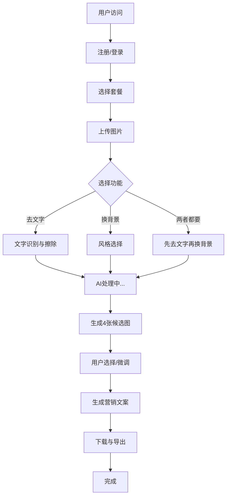

# 产品需求文档 (PRD)：跨境电商视觉本地化 AI (GlobalPic AI)

## 1. 项目概述

### 1.1 产品信息
- **产品名称**：GlobalPic AI (全球图)
- **产品定位**：面向跨境电商的智能视觉本地化平台
- **一句话描述**：面向 TikTok/亚马逊中小卖家的"一键去中文 + 欧美风重绘"营销素材生成器
- **核心价值**：解决中国卖家"图土、有中文、不懂欧美审美"导致点击率低的痛点
- **目标用户**：义乌/深圳的跨境电商个体户、Dropshipping 玩家、独立站卖家

### 1.2 商业模式
- **免费试用**：3 张图片免费体验
- **订阅制**：$19/月，无限生成
- **按需付费**：$0.5/张，适合偶尔使用
- **企业版**：$99/月，支持团队协作、API接入

## 2. 市场分析与竞品

### 2.1 市场机会
- 跨境电商市场规模超过 4.5 万亿美元
- 视觉内容是影响转化率的关键因素（CTR 平均提升 25%）
- 中国卖家视觉本土化需求强烈但解决方案匮乏

### 2.2 竞品分析
| 功能维度 | GlobalPic AI | Canva | Photoshop | Remove.bg | Figma AI |
|----------|-------------|-------|-----------|-----------|----------|
| 智能去字 | ✅ AI驱动 | ❌ 手动 | ❌ 需要技能 | ✅ 但功能单一 | ❌ |
| 场景重绘 | ✅ 欧美风格库 | ❌ | ❌ 需要技能 | ❌ | ❌ |
| 双语支持 | ✅ 中英双语 | ❌ | ❌ | ❌ | ❌ |
| 生成速度 | 10-20秒 | 1-5分钟 | 5-15分钟 | 3-8秒 | 10-30分钟 |
| 价格 | $19/月 | $15/月 | $20/月 | $9.99/月 | $15/月 |

## 3. 用户画像与核心场景

### 3.1 核心用户画像
**主要用户：李明**
- **基本信息**：30岁，义乌小商品卖家
- **痛点**：拼多多图片有中文，在美国 TikTok Shop 转化率低
- **需求**：Instagram 风格的高级产品图，无中文，欧美审美
- **预算**：月营销预算 $500-2000

**次要用户：王丽**
- **基本信息**：28岁，深圳3C配件卖家
- **痛点**：1688拿货图片背景杂乱，无法突出产品
- **需求**：极简风格产品图，适合亚马逊Listing
- **预算**：月营销预算 $1000-5000

### 3.2 核心使用场景
1. **淘宝/1688 产品图本地化**：去除中文，替换欧美风格背景
2. **亚马逊Listing优化**：生成符合平台要求的产品图
3. **TikTok营销素材**：创建吸引眼球的短视频封面图
4. **独立站产品展示**：提升品牌形象和转化率

## 4. 功能需求清单

### 4.1 核心功能模块

| 优先级 | 功能名称 | 详细描述 | 技术实现 | 性能指标 | 状态 |
|--------|----------|----------|----------|----------|------|
| **P0** | **智能文字抹除 (Clean)** | 自动识别并擦除图片中的中文/水印，智能补全背景 | Z-Image-Turbo + OCR文字检测 | 准确率 >90%，处理时间 <15s | ✅ 可用 |
| **P0** | **AI场景重绘 (Remix)** | 保持商品主体不变，将背景替换为欧美风格场景 | Z-Image-Turbo + SAM分割 | 生成时间 <10s，支持10+风格 | ✅ 可用 |
| **P0** | **主体分割提取** | 精确提取产品主体，避免变形 | Segment Anything Model (SAM) | 边界准确率 >98% | ✅ 可用 |
| **P1** | **智能文案生成** | 根据图片生成符合平台SEO的英文营销文案 | GPT-4o-mini + 模板库 | 5条文案/图，支持平台优化 | ✅ 可用 |
| **P1** | **尺寸适配转换** | 自动裁剪/填充适应不同平台要求 | OpenCV + AI Outpainting | 支持9种尺寸规格 | ✅ 可用 |
| **P2** | **批量处理** | 支持多张图片同时处理，提高效率 | 队列系统 + 并发处理 | 最多50张/批，处理时间线性增长 | ✅ 可用 |
| **P3** | **高级图像编辑** | 基于自然语言的精细图像编辑 | Z-Image-Edit + 指令跟随 | 支持复杂编辑操作 | ⏳ 待发布 |
| **P3** | **风格定制** | 允许用户自定义背景风格和元素 | LoRA微调 + 风格库 | 支持用户上传风格参考 | ⏳ 待开发 |

### 4.2 支持的背景风格

#### 欧美现代风格 (Western Modern)
- **极简纯色**：白色/灰色/米色背景，突出产品本身
- **现代家居**：现代厨房、客厅、办公室场景
- **商业环境**：专业办公桌、展示台、商店环境
- **自然光线**：户外阳光、窗边自然光场景

#### 电商专用风格 (E-commerce)
- **亚马逊标准**：白色背景，产品居中，符合平台规范
- **TikTok风格**：鲜艳色彩，吸引眼球，适合短视频
- **Instagram风**：时尚、生活化场景，提升品牌形象
- **独立站风格**：多样化设计，体现品牌调性

### 4.3 平台尺寸规格支持

| 平台 | 尺寸比例 | 用途 | 输出规格 |
|------|----------|------|----------|
| Amazon | 1:1 (1000x1000) | 主图 | JPG, PNG |
| TikTok | 9:16 (1080x1920) | 视频封面 | JPG, PNG |
| Facebook | 4:5 (1080x1350) | 帖子 | JPG, PNG |
| Instagram | 1:1, 4:5, 9:16 | 帖子/故事 | JPG, PNG |
| eBay | 1:1 (1600x1600) | 主图 | JPG, PNG |
| Shopify | 16:9 (1920x1080) | Banner | JPG, PNG |

## 5. 技术架构设计

### 5.1 核心技术栈

#### AI模型选择
- **图像生成**：Z-Image-Turbo (主模型)
  - 优势：sub-second推理速度，8 NFE，16GB VRAM消费级设备可用
  - 部署：diffusers库加载，支持Hugging Face和ModelScope
  - 内存需求：16GB VRAM (推荐) / 企业级H800 GPU (最优)
  - 特殊说明：无需Classifier-Free Guidance (guidance_scale=0.0)
  - 模型参数：6B参数，Single-Stream DiT架构

- **图像编辑**：Z-Image-Edit (专用编辑模型)
  - 优势：指令跟随能力强，支持精细编辑
  - 用途：文字擦除、局部修改、精确控制
  - 状态：待发布模型

- **分割提取**：Segment Anything Model (SAM)
  - 用途：产品主体精确分割
  - 优势：zero-shot分割，无需额外训练

#### 技术架构细节
- **核心架构**：Scalable Single-Stream DiT (S3-DiT)
  - 文本、视觉语义令牌、图像VAE令牌序列级连接
  - 统一输入流，最大化参数效率
- **参数规模**：6B参数
- **加速算法**：Decoupled-DMD + DMDR后训练

#### 技术架构图
```
┌─────────────────┐    ┌─────────────────┐    ┌─────────────────┐
│   前端界面      │    │   API网关      │    │   后端服务      │
│  React/Vue     │◄──►│   FastAPI      │◄──►│   Python        │
│  文件上传      │    │   负载均衡     │    │   AI模型服务    │
└─────────────────┘    └─────────────────┘    └─────────────────┘
                                                        │
                                ┌───────────────────────┼───────────────────────┐
                                │                       │                       │
                    ┌─────────────────┐    ┌─────────────────┐    ┌─────────────────┐
                    │  Z-Image-Turbo │    │  Z-Image-Edit   │    │     SAM模型     │
                    │   图像生成     │    │   图像编辑     │    │   主体分割     │
                    └─────────────────┘    └─────────────────┘    └─────────────────┘
                                │                       │                       │
                    ┌─────────────────┐    ┌─────────────────┐    ┌─────────────────┐
                    │  风格库管理    │    │   文案生成     │    │   文件存储     │
                    │  提示词工程    │    │   GPT-4-mini   │    │   S3/MinIO     │
                    └─────────────────┘    └─────────────────┘    └─────────────────┘
```

### 5.2 性能指标要求

#### 响应时间
- **文字擦除**：< 10秒
- **场景重绘**：< 15秒  
- **主体分割**：< 3秒
- **文案生成**：< 5秒
- **总体流程**：< 30秒

#### 质量指标
- **文字擦除准确率**：> 95%
- **主体保真度**：> 98% (无变形)
- **背景自然度**：用户评分 > 4.2/5.0
- **整体满意度**：用户评分 > 4.5/5.0

#### 系统容量
- **并发处理**：支持100个用户同时在线
- **日处理量**：10,000张图片
- **存储容量**：100TB (图片 + 缓存)
- **可用性**：99.9%

## 6. 用户体验流程 (User Flow)

### 6.1 完整用户旅程



### 6.2 详细交互流程

#### 第一步：图片上传
- **支持格式**：JPG, PNG, WEBP
- **尺寸限制**：最大 20MB，最小 512x512
- **拖拽上传**：支持批量拖拽（最多9张）
- **预览功能**：上传前预览，支持裁剪

#### 第二步：功能选择
```
[ ] 智能去文字 (Clean)
[ ] 场景重绘 (Remix) 
[ ] 主体分割 (Extract)
[ ] 尺寸适配 (Resize)

背景风格选择：
○ 极简纯色
○ 现代家居  
○ 商业环境
○ 自然光线
○ 自定义上传
```

#### 第三步：AI处理
- **进度显示**：实时进度条和预计完成时间
- **处理状态**：
  - 正在分析图片... (10%)
  - 正在检测文字... (25%)
  - 正在分割主体... (50%)
  - 正在生成背景... (75%)
  - 正在优化图片... (90%)

#### 第四步：结果展示
- **候选图片**：4张不同风格的高清预览
- **对比功能**：原图 vs 处理后对比
- **微调选项**：
  - 背景亮度调节
  - 颜色饱和度调整
  - 细节增强
  - 风格强度控制

#### 第五步：文案生成
- **平台适配**：根据选择的平台生成对应风格的文案
- **SEO优化**：关键词密度和排名优化
- **A/B测试**：生成多个版本供选择
- **一键复制**：支持复制到剪贴板

## 7. 技术实现细节

### 7.1 Z-Image模型集成

#### 模型选择策略
```python
# 根据任务类型选择模型
def select_model(task_type, image_quality="high"):
    if task_type == "text_removal":
        # Z-Image-Edit尚未发布，使用替代方案
        return "Z-Image-Turbo-with-inpainting"  
    elif task_type == "background_replace":
        return "Z-Image-Turbo"  # 快速生成模型
    elif task_type == "style_transfer":
        return "Z-Image-Turbo"  # 风格转换
    else:
        return "Z-Image-Turbo"  # 默认模型
```

#### 正确使用Z-Image-Turbo
```python
import torch
import time
from zimage import generate
from utils import set_attention_backend

# 1. 模型配置
dtype = torch.bfloat16
height = 1024
width = 1024
num_inference_steps = 8  # 实际8步
guidance_scale = 0.0  # Turbo模型不需要CFG
seed = 42

# 2. 设备选择 (优先级: cuda -> tpu -> mps -> cpu)
if torch.cuda.is_available():
    device = "cuda"
elif torch.backends.mps.is_available():
    device = "mps"
else:
    device = "cpu"

# 3. 可选：设置注意力后端
attn_backend = "_native_flash"  # 或 "flash", "_flash_3"
set_attention_backend(attn_backend)

# 4. 核心生成代码
prompt = "Professional product photography, modern minimalist background, high quality, clean composition"
images = generate(
    prompt=prompt,
    height=height,
    width=width,
    num_inference_steps=num_inference_steps,
    guidance_scale=guidance_scale,
    generator=torch.Generator(device).manual_seed(seed),
)

# 5. 性能测试
start_time = time.time()
# 生成图像
end_time = time.time()
print(f"Time taken: {end_time - start_time:.2f} seconds")
```

#### Diffusers 集成方案
```python
from diffusers import ZImagePipeline
import torch

# 使用diffusers库的方式
pipe = ZImagePipeline.from_pretrained(
    "Tongyi-MAI/Z-Image-Turbo",
    torch_dtype=torch.bfloat16,
    low_cpu_mem_usage=False,
)
pipe.to("cuda")

image = pipe(
    prompt=prompt,
    height=1024,
    width=1024,
    num_inference_steps=8,
    guidance_scale=0.0,
    generator=torch.Generator("cuda").manual_seed(42),
).images[0]
```

#### 推理优化策略
- **数据类型**：使用bfloat16获得最佳GPU性能
- **注意力优化**：Flash Attention 2/3提供更好的效率
- **模型编译**：首次运行编译，后续推理加速
- **CPU offloading**：内存受限设备的内存优化
- **批处理**：合并相似请求，提高GPU利用率
- **缓存机制**：常用风格预计算，减少等待时间

### 7.2 核心算法流程

#### 文字擦除算法（当前可用方案）
```python
def remove_text_inpainting(image):
    # 1. OCR文字检测
    text_regions = detect_text_regions(image)
    
    # 2. 文字区域掩码生成
    mask = generate_inpainting_mask(text_regions)
    
    # 3. 使用Z-Image-Turbo进行修复（替代Z-Image-Edit）
    # 将mask应用到图像，然后在修复区域生成新内容
    masked_image = apply_mask_to_image(image, mask)
    
    prompt = "Clean product photography background, no text, professional lighting"
    clean_image = pipe(
        prompt=prompt,
        image=masked_image,
        mask_image=mask,
        num_inference_steps=9,
        guidance_scale=0.0,
    ).images[0]
    
    # 4. 质量检测与优化
    quality_score = assess_image_quality(clean_image)
    if quality_score < threshold:
        clean_image = enhance_image_quality(clean_image)
    
    return clean_image
```

#### 场景重绘算法（优化版本）
```python
def replace_background(image, target_style):
    # 1. SAM主体分割
    subject_mask = sam.segment_subject(image)
    
    # 2. 提取主体部分
    subject_only = apply_mask(image, subject_mask)
    
    # 3. 构建风格化提示词
    style_prompts = {
        "minimalist": "Clean white background, minimalist, professional product photography",
        "modern": "Modern home interior, contemporary furniture, soft natural lighting",
        "outdoor": "Outdoor natural light, clean environment, professional photography"
    }
    
    # 4. Z-Image-Turbo生成新背景
    background_prompt = style_prompts.get(target_style, style_prompts["minimalist"])
    new_background = pipe(
        prompt=background_prompt,
        height=image.shape[0],
        width=image.shape[1],
        num_inference_steps=9,
        guidance_scale=0.0,
    ).images[0]
    
    # 5. 高质量合成
    final_image = composite_images(
        subject=subject_only,
        background=new_background,
        mask=subject_mask,
        blend_mode="seamless"
    )
    
    return final_image
```

#### 完整的图像处理流程
```python
def process_product_image(image_path, operations):
    """
    完整的图像处理流程
    
    Args:
        image_path: 输入图片路径
        operations: 包含['clean', 'background', 'resize']的列表
    
    Returns:
        处理后的图片和元数据
    """
    # 1. 加载图片
    image = load_image(image_path)
    
    # 2. 根据操作列表执行处理
    results = []
    
    for operation in operations:
        if operation == "clean":
            image = remove_text_inpainting(image)
        elif operation == "background":
            image = replace_background(image, "minimalist")
        elif operation == "resize":
            image = resize_for_platform(image, "amazon")
    
    return image
```

### 7.3 性能优化策略

#### 缓存机制
- **模型缓存**：预加载常用模型到内存
- **结果缓存**：相同参数的处理结果缓存24小时
- **CDN加速**：静态资源和生成结果全球分发

#### 并发处理
```python
# 异步任务队列
from celery import Celery

app = Celery('globalpic')

@app.task(bind=True, max_retries=3)
def process_image(self, image_data, task_config):
    try:
        # 并行处理多个子任务
        tasks = [
            remove_text_task.delay(image_data),
            replace_background_task.delay(image_data, task_config['style']),
            generate_copy_task.delay(image_data)
        ]
        
        results = [task.get() for task in tasks]
        return combine_results(results)
        
    except Exception as exc:
        self.retry(countdown=60, exc=exc)
```

## 8. 产品规格与质量要求

### 8.1 输出质量标准

#### 图片质量要求
- **分辨率**：最低 1024x1024，支持4K输出
- **格式**：JPG (质量90+), PNG (无损)
- **色彩空间**：sRGB，符合web标准
- **压缩**：智能压缩，文件大小 < 5MB

#### 处理质量指标
| 指标类型 | 具体要求 | 测量方法 |
|----------|----------|----------|
| 文字擦除 | 擦除率 > 95% | OCR检测残留文字 |
| 主体保真 | 变形率 < 2% | 特征点匹配算法 |
| 背景自然 | 合成度 > 4.0/5.0 | 用户主观评分 |
| 整体美观 | 满意度 > 4.5/5.0 | A/B测试结果 |

### 8.2 用户界面要求

#### 设计原则
- **简洁高效**：核心功能3步完成
- **即时反馈**：所有操作立即显示结果
- **批量友好**：支持拖拽批量处理
- **移动适配**：响应式设计，支持手机操作

#### 关键界面设计
1. **上传页面**：大尺寸拖拽区域，支持多文件
2. **处理页面**：实时进度条，步骤可视化
3. **结果页面**：4宫格预览，对比查看
4. **编辑页面**：简单画笔工具，局部调整

## 9. 商业模式与定价策略

### 9.1 定价结构

#### 个人版 ($19/月)
- **无限生成**：每月无限制图片处理
- **高清输出**：最高4K分辨率
- **全部功能**：文字擦除、场景重绘、文案生成
- **客服支持**：邮件支持

#### 按需付费 ($0.5/张)
- **即时购买**：无需订阅，按张数计费
- **同等质量**：与订阅版相同输出质量
- **适合用户**：偶尔使用的卖家

#### 企业版 ($99/月)
- **团队协作**：多用户账户管理
- **API接入**：提供RESTful API
- **批量处理**：最高500张/批处理
- **优先支持**：专属客服，技术支持

### 9.2 成本结构分析

#### 技术成本 (每张图片)
- **GPU计算**：$0.02 (基于A100 GPU成本)
- **存储费用**：$0.001 (S3存储)
- **带宽费用**：$0.001 (CDN传输)
- **总计**：$0.022/张

#### 运营成本 (每月)
- **服务器**：$2,000 (云服务)
- **CDN费用**：$500 (全球分发)
- **第三方API**：$300 (OCR、文案生成)
- **人力成本**：$10,000 (开发维护)
- **总计**：$12,800/月

#### 盈利分析
- **个人版用户**：500用户 × $19 = $9,500/月
- **按需付费**：10,000张 × $0.5 = $5,000/月
- **企业版用户**：10企业 × $99 = $990/月
- **总收入**：$15,490/月
- **利润率**：($15,490 - $12,800) / $15,490 = 17.4%

## 10. 开发计划与里程碑

### 10.1 MVP阶段 (第1-3个月)

#### 核心功能开发
- [ ] **第1个月**：基础框架搭建 + Z-Image模型集成
- [ ] **第2个月**：文字擦除 + 主体分割功能
- [ ] **第3个月**：场景重绘 + 用户界面完善

#### 交付标准
- ✅ 支持JPG/PNG上传 (最大20MB)
- ✅ 文字擦除准确率 > 90%
- ✅ 基础背景重绘 (5种风格)
- ✅ 响应式Web界面
- ✅ 用户注册/登录系统

### 10.2 商业化阶段 (第4-6个月)

#### 功能扩展
- [ ] **第4个月**：文案生成 + 多平台尺寸适配
- [ ] **第5个月**：批量处理 + 高级编辑功能
- [ ] **第6个月**：企业版开发 + API接口

#### 交付标准
- ✅ 完整商业功能 (订阅、支付)
- ✅ 处理速度 < 30秒/张
- ✅ 支持10种背景风格
- ✅ 批量处理 (最多50张)
- ✅ 移动端适配

### 10.3 规模化阶段 (第7-12个月)

#### 系统优化
- [ ] **第7-9个月**：性能优化 + 缓存系统
- [ ] **第10-12个月**：企业功能 + 国际化

#### 交付标准
- ✅ 支持100+并发用户
- ✅ 99.9%系统可用性
- ✅ 支持企业API接入
- ✅ 多语言界面 (中英文)
- ✅ 高级分析报表

## 11. 风险评估与应对策略

### 11.1 技术风险

#### AI模型依赖风险
- **风险描述**：Z-Image模型性能不达预期
- **应对策略**：
  - 备用方案：Stable Diffusion + ControlNet
  - 模型对比测试，建立性能基线
  - 与模型方建立技术支持通道

#### 处理速度风险  
- **风险描述**：大规模并发时处理速度下降
- **应对策略**：
  - 弹性扩容机制
  - 智能任务队列调度
  - 边缘计算节点部署

### 11.2 商业风险

#### 竞争风险
- **风险描述**：大厂推出类似功能
- **应对策略**：
  - 专注细分市场，深耕用户体验
  - 建立技术护城河 (自定义风格库)
  - 快速迭代，优先抢占市场

#### 用户接受度风险
- **风险描述**：用户对AI生成效果不满意
- **应对策略**：
  - 详细用户调研和原型测试
  - 渐进式功能发布，及时收集反馈
  - 提供人工客服和优化服务

## 12. 成功指标与监控

### 12.1 核心指标 (KPIs)

#### 用户增长指标
- **月活用户数 (MAU)**：目标 1,000 (3个月)
- **用户留存率**：目标 40% (7天留存)
- **转化率**：免费试用到付费转化 > 15%
- **用户满意度**：NPS评分 > 50

#### 产品性能指标
- **处理成功率**：> 98%
- **平均处理时间**：< 30秒
- **图片质量评分**：> 4.2/5.0
- **系统可用性**：99.9%

#### 商业指标
- **月收入 (MRR)**：目标 $10,000 (6个月)
- **客户获取成本 (CAC)**：< $20
- **客户生命周期价值 (LTV)**：> $200
- **LTV/CAC比例**：> 10:1

### 12.2 监控体系

#### 技术监控
- **实时指标**：处理队列长度、GPU使用率、API响应时间
- **错误监控**：处理失败率、异常日志、用户投诉
- **性能监控**：服务器负载、数据库性能、缓存命中率

#### 业务监控
- **用户行为**：页面访问、转化漏斗、功能使用频次
- **收入监控**：订阅状态、续费率、退款率
- **质量监控**：图片质量评分、用户满意度调查

## 13. 附录

### 13.1 技术术语解释

- **Inpainting (图像修复)**：使用AI算法智能填补图像中缺失或不需要的部分
- **Outpainting (图像扩展)**：将图像向外扩展，补充更多背景内容  
- **NFE (Number of Function Evaluations)**：扩散模型中的采样步数，影响生成速度和质量
- **SAM (Segment Anything Model)**：Meta开发的人工智能模型，可以分割图像中的任何对象
- **ControlNet**：Stable Diffusion的控制模块，用于精确控制生成结果

### 13.2 相关资源链接

- **Z-Image模型**：https://github.com/Tongyi-MAI/Z-Image
- **Hugging Face模型**：https://huggingface.co/Tongyi-MAI/Z-Image-Turbo
- **在线演示**：https://huggingface.co/spaces/Tongyi-MAI/Z-Image-Turbo
- **技术论文**：https://arxiv.org/abs/2511.22699

### 13.3 社区生态支持

#### 第三方工具集成
- **Cache-DiT**：提供 Z-Image 推理加速，支持 DBCache 和并行处理
- **stable-diffusion.cpp**：纯C++推理引擎，4GB VRAM即可运行
- **LeMiCa**：时间级加速方法，方便快捷
- **ComfyUI-ZImageLatent**：易于使用的 Z-Image 潜在空间
- **DiffSynth-Studio**：支持 LoRA 训练、全训练、蒸馏训练
- **vllm-omni**：多模态模型快速推理和服务框架
- **SGLang-Diffusion**：支持 Z-Image 的先进性能加速

#### 技术指标验证
- **Artificial Analysis 排行榜**：排名第8，#1开源模型
- **Alibaba AI Arena**：在开源模型中表现最优，与专有模型竞争
- **基准测试**：在多项独立基准上持续展示最先进结果

### 13.4 模型依赖风险评估

#### 当前可用性
- **Z-Image-Turbo**：✅ 已发布可用
- **Z-Image-Edit**：⏳ 待发布，需要备用方案
- **备用方案**：Stable Diffusion + ControlNet

#### 技术支持
- **官方支持**：与阿里通义千问团队建立技术支持通道
- **社区支持**：活跃的开源社区和丰富的第三方工具
- **版本管理**：严格的版本控制，确保向前兼容

### 13.3 联系信息

- **产品负责人**：[姓名] [邮箱]
- **技术负责人**：[姓名] [邮箱]  
- **商业负责人**：[姓名] [邮箱]
- **客服支持**：[邮箱] / [微信群]

---

**文档版本**：v1.0  
**最后更新**：2025-12-28  
**下次更新计划**：MVP完成后，根据实际开发情况调整